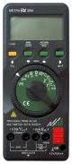
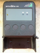

# OpenMetra




The project OpenMetra receives data from a multimeter Gossen METRAHit 29S via the BD232 serial interface.
The BD232 is powered by the RTS and DTR serial lines. Works with e.g. FTDI RS232 USB connection to /dev/ttyUSB0 (linux).

Activate the transmission on the instrument with: 'SEt v SEnd <-/ OFF v on <-/',
or at switch-on by depressing **DATA/CLEAR** and **ON** button together.
Rate of data beeing sent into interface depends on the item 'rAtE' that can be set in the meter's menu.


## Hardware

Get [info and documents](https://www.gossenmetrawatt.com/english/produkte/metrahit29s.htm)
from [gossenmetrawatt.com](https://www.gossenmetrawatt.com/).


## Software

Access to the multimeter and decoding of the received data is done in the OpenMetra class.
Just add the directory `openmetra` to your project and you're done.
Switch the meter to transmit mode (press **DATA/CLEAR** and **ON** together) and retrieve the data with this simple program:

```python
#!/usr/bin/python

import sys

from openmetra import OpenMetra

with OpenMetra() as mh: # open connection to '/dev/ttyUSB0', the serial path can be an optional parameter
    if mh is None:      # could not connect
        print( 'connect error', file=sys.stderr)
        sys.exit()
    while True:                             # run forever, stop with ^C
        try:
            print( mh.get_measurement() )   # print numeric value
        except KeyboardInterrupt:           # ^C pressed, stop measurement
            print()
            break                           # exit
```

The provided program [OpenMetra](https://github.com/Ho-Ro/OpenMetra/blob/main/OpenMetra)
allows to customize the received date with some options:

````
usage: OpenMetra [-h] [-c] [-d SERIAL_DEVICE] [-f] [-g] [-n NUMBER] [-o] [-s SECONDS] [-t] [-u] [-U]
                 [-V]

Get data from Gossen METRAHit 29S

optional arguments:
  -h, --help            show this help message and exit
  -c, --csv             create csv (together with -t and/or -u)
  -d SERIAL_DEVICE, --device SERIAL_DEVICE
                        device path of serial interface, default is "/dev/ttyUSB0"
  -f, --format_values   print formatted values (instead of as shown on meter)
  -g, --german          use comma as decimal separator, semicolon as field separator
  -n NUMBER, --number NUMBER
                        get NUMBER measurement values
  -o, --overload        print OL values as "None" instead of skipping
  -s SECONDS, --seconds SECONDS
                        measure for a duration of SECONDS
  -t, --timestamp       print timestamp for each value
  -u, --unit            print unit of measured value
  -U, --unit_long       print unit of measured value with explanation, e.g. AC, DC, etc
  -V                    increase verbosity
````

### Building and Installing a Debian Package

The provided [Makefile](https://github.com/Ho-Ro/OpenMetra/blob/main/Makefile) allows to build a Debian package,
just type `make`. `make distclean` removes all created data to prepare for a clean build.
You need to install python3-stdeb, the Python to Debian source package conversion plugins for distutils.
After success the package is available in directory `deb_dist`.
You can do a clean install (as root) with `dpkg -i deb_dist/openmetra_*_all.deb`, the python module `openmetra` is put into
the python3 library path, the script OpenMetra is copied into `/usr/bin`. `dpkg -P openhantek` does a clean uninstall.


## Protocol Definition:

The instrument sends the data blocks with 9600 Bd, 8 bits + Start + Stop bit (only lower 6 bits are used).

### Fast Mode

Measured data with fast rate (rate 50 ms, V_DC, A_DC only)
````
-----------------------------------------------
|Byte| Output unit Bit0..Bit3       |Bit5|Bit4|
|----|------------------------------|----|----|
|  1 | Measuring range, sign        |  0 |  1 |
|  2 | Units                        |  1 |  1 |
|  3 | Tens                         |  1 |  1 |
|  4 | Hundreds                     |  1 |  1 |
|  5 | Thousands                    |  1 |  1 |
|  6 | TenThousands                 |  1 |  1 |
-----------------------------------------------
````

Instruments setting with fast rate (sent at lower rate of ~ 500 ms)
````
-----------------------------------------------
|Byte| Output unit Bit0..Bit3       |Bit5|Bit4|
|----|------------------------------|----|----|
|  1 | Device code, 1110 is 29s     |  0 |  0 |
|  2 | Curr. type, meas. variable 1 |  1 |  1 |
|  3 | Special character 1          |  1 |  1 |
|  4 | Special character 2          |  1 |  1 |
|  5 | Measuring range, sign 1      |  1 |  1 |
-----------------------------------------------
````

### Slow Mode

Ranges: V AC, V AC+DC, I AC+DC, Ohm, Ohm with buzzer, F, Hz , Temp., dB,
V-diode, V-diode with buzzer, Events, Counter, Mains analysis and Power.
Also V DC, A DC and functions when send interval >50 ms.
````
-----------------------------------------------
|Byte| Output unit Bit0..Bit3       |Bit5|Bit4|
|----|------------------------------|----|----|
|  1 | Device code, 1110 is 29s     |  0 |  0 |
|  2 | Curr. type, meas. variable 1 |  1 |  1 |
|  3 | Special character 1          |  1 |  1 |
|  4 | Special character 2          |  1 |  1 |
|  5 | Measuring range, sign        |  1 |  1 |
|  6 | Units                        |  1 |  1 |
|  7 | Tens                         |  1 |  1 |
|  8 | Hundreds                     |  1 |  1 |
|  9 | Thousands                    |  1 |  1 |
| 10 | TenThousands                 |  1 |  1 |
| 11 | HundredThousands             |  1 |  1 |
| 12 | Curr. type, meas. variable 2 |  1 |  1 |
| 13 | Send interval                |  1 |  1 |
-----------------------------------------------
````
29S: In case of power measurement there are sent 3 of these blocks
with delay 200 ms in order power - W, voltage - V, current - A.

- See also:
https://www.mikrocontroller.net/attachment/22868/22SM-29S_Interface_Protocol1.pdf

