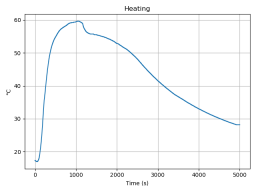
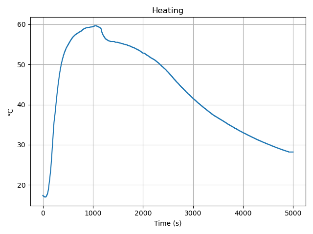

# OpenMetra




Receives data from a multimeter Gossen METRAHit 29S via BD232 serial interface.

Tested with FTDI and similar RS232 USB serial interfaces to "/dev/ttyUSB0" (linux).

Should also work for Windows with e.g. serial_device="COM8".

Activate the transmission on the instrument with: 'SEt v SEnd <-/ OFF v on <-/',
or at switch-on by depressing **DATA/CLEAR** and **ON** button together.
Rate of data beeing sent can be set in the meter's menu with the item 'rAtE'.


## Hardware

Get [info and documents](https://www.gossenmetrawatt.com/english/produkte/metrahit29s.htm)
from [gossenmetrawatt.com](https://www.gossenmetrawatt.com/).


## Software

Access to the multimeter and decoding of the received data is done in the OpenMetra class.
Just add the directory `openmetra` to your project and you're done.
Switch the meter to transmit mode (press **DATA/CLEAR** and **ON** together) and retrieve the data with this simple program:

```python
#!/usr/bin/python

import sys

from openmetra import OpenMetra

with OpenMetra() as mh: # open connection to '/dev/ttyUSB0', the serial path can be an optional parameter
    if mh is None:      # could not connect
        print( 'connect error', file=sys.stderr)
        sys.exit()
    while True:                             # run forever, stop with ^C
        try:
            print( mh.get_measurement() )   # print numeric value
        except KeyboardInterrupt:           # ^C pressed, stop measurement
            print()
            break                           # exit
```

The provided program [Metra](https://github.com/Ho-Ro/OpenMetra/blob/main/Metra)
allows to customize the received date with some options:

````
usage: Metra [-h] [-c] [-d SERIAL_DEVICE] [-f] [-g] [-n NUMBER] [-o] [-O] [-r RATE]
             [-s SECONDS] [-t] [-T TIMEOUT] [-u] [-U] [-v] [-V]

Get data from Gossen METRAHit 29S

optional arguments:
  -h, --help            show this help message and exit
  -c, --csv             create csv (together with -t and/or -u)
  -d SERIAL_DEVICE, --device SERIAL_DEVICE
                        device path of serial interface, default is "/dev/ttyUSB0"
  -f, --format_values   print formatted values (instead of as shown on meter)
  -g, --german          use comma as decimal separator, semicolon as field separator
  -n NUMBER, --number NUMBER
                        get NUMBER measurement values
  -o, --on-off          switch meter on, select send mode and rate and switch off after
                        measurement
  -O, --overload        print OL values as "None" instead of skipping
  -r RATE, --rate RATE  select index for measurement rate: 0:50ms, 1:0.1s, 2:0.2s, 3:0.5s,
                        4:1s, 5:2s, 6:5s, 7:10s, 8:20s, 9:30s, 10:1min, 11:2min, 12:5min,
                        13:10min, default: 4 (1s)
  -s SECONDS, --seconds SECONDS
                        measure for a duration of SECONDS
  -t, --timestamp       print timestamp for each value
  -T TIMEOUT, --timeout TIMEOUT
                        set timeout for serial port
  -u, --unit            print unit of measured value
  -U, --unit_long       print unit of measured value with explanation, e.g. AC, DC, etc
  -v, --version         show openmetra version
  -V                    increase verbosity
````

The program [MetraPlot](https://github.com/Ho-Ro/OpenMetra/blob/main/MetraPlot)
displays the measured data nicely:

````
usage: MetraPlot [-h] [-t TITLE] [-f FIRST_SAMPLE] [-l LAST_SAMPLE] [-V] [infile]

Plot data - e.g. received from Gossen METRAHit 29S via program 'Metra'

positional arguments:
  infile                read measurement data from optional infile, use stdin otherwise

optional arguments:
  -h, --help            show this help message and exit
  -t TITLE, --title TITLE
                        set the title of the plot, default is 'MetraPlot'
  -f FIRST_SAMPLE, --first_sample FIRST_SAMPLE
                        first sample to display
  -l LAST_SAMPLE, --last_sample LAST_SAMPLE
                        last sample to display
  -V                    increase verbosity
````



The program [MetraSwitch](https://github.com/Ho-Ro/OpenMetra/blob/main/MetraSwitch)
switches the instrument on and selects send mode or selects the measurement function or switches the intrument off:

````
usage: MetraSwitch [-h] [-d DEVICE] [--off | --function FUNCTION | --rate RATE | --set_rtc]
                   [-v] [-V]

Gossen METRAHit 29S: switch off or select function or select data rate or set RTC time and
date. Without specifying an action the meter is just switched on.

optional arguments:
  -h, --help            show this help message and exit
  -d DEVICE, --device DEVICE
                        device path of serial interface, default is "/dev/ttyUSB0"
  --off                 switch the device off
  --function FUNCTION   select measurement function: 1:V_DC, 2:V_ACDC, 3:V_AC, 4:mA_DC,
                        5:mA_ACDC, 6:A_DC, 7:A_ACDC, 8:Ohm, 9:F, 10:dB, 11:Hz_Uacdc,
                        12:Hz_Uac, 17:Ohm buzzer, 18:Temp, 22:pulseW, 23TRMS_mains,
                        24:Counter, 25:Events_Uacdc, 26:Events_Uac
  --rate RATE           select index of measurement rate: 0:50ms, 1:0.1s, 2:0.2s, 3:0.5s,
                        4:1s, 5:2s, 6:5s, 7:10s, 8:20s, 9:30s, 10:1min, 11:2min, 12:5min,
                        13:10min
  --set_rtc             set meter RTC time and date from local time
  -v, --version         show openmetra version
  -V                    increase verbosity
````


### Building and Installing a Debian Package

The provided [Makefile](https://github.com/Ho-Ro/OpenMetra/blob/main/Makefile) allows to build a Debian package,
just type `make`. `make distclean` removes all created data to prepare for a new clean build.
You need to install python3-stdeb, the Python to Debian source package conversion plugins for distutils.
After success the package is available as `openmetra_*_all.deb`.
You can do a clean install (as root) with `dpkg -i openmetra_*_all.deb`, the python module `openmetra` is put into
the python3 library path, the scripts `Metra*` are copied into `/usr/bin`. `dpkg -P openhantek` does a clean uninstall.
It is also possible to build an (experimental) rpm package with `make rpm` as `openmetra-*.noarch.rpm`.

## Protocol Definition:

The instrument sends the data blocks with 9600 Bd, 8 bits + Start + Stop bit (only lower 6 bits are used).

### Fast Mode

TM1a) Measured data with fast rate (rate 50 ms, V_DC, A_DC only)
````
-----------------------------------------------
|Byte| Output unit Bit0..Bit3       |Bit5|Bit4|
|----|------------------------------|----|----|
|  1 | Measuring range, sign        |  0 |  1 |
|  2 | Units                        |  1 |  1 |
|  3 | Tens                         |  1 |  1 |
|  4 | Hundreds                     |  1 |  1 |
|  5 | Thousands                    |  1 |  1 |
|  6 | TenThousands                 |  1 |  1 |
-----------------------------------------------
````

TM1b) Instruments setting with fast rate (sent at lower rate of ~ 500 ms)
````
-----------------------------------------------
|Byte| Output unit Bit0..Bit3       |Bit5|Bit4|
|----|------------------------------|----|----|
|  1 | Device code, 1110 is 29s     |  0 |  0 |
|  2 | Curr. type, meas. variable 1 |  1 |  1 |
|  3 | Special character 1          |  1 |  1 |
|  4 | Special character 2          |  1 |  1 |
|  5 | Measuring range, sign 1      |  1 |  1 |
-----------------------------------------------
````

### Slow Mode

TM2) Ranges: V AC, V AC+DC, I AC+DC, Ohm, Ohm with buzzer, F, Hz , Temp., dB,
V-diode, V-diode with buzzer, Events, Counter, Mains analysis and Power.
Also V DC, A DC and functions when send interval >50 ms.
````
-----------------------------------------------
|Byte| Output unit Bit0..Bit3       |Bit5|Bit4|
|----|------------------------------|----|----|
|  1 | Device code, 1110 is 29s     |  0 |  0 |
|  2 | Curr. type, meas. variable 1 |  1 |  1 |
|  3 | Special character 1          |  1 |  1 |
|  4 | Special character 2          |  1 |  1 |
|  5 | Measuring range, sign        |  1 |  1 |
|  6 | Units                        |  1 |  1 |
|  7 | Tens                         |  1 |  1 |
|  8 | Hundreds                     |  1 |  1 |
|  9 | Thousands                    |  1 |  1 |
| 10 | TenThousands                 |  1 |  1 |
| 11 | HundredThousands             |  1 |  1 |
| 12 | Curr. type, meas. variable 2 |  1 |  1 |
| 13 | Send interval                |  1 |  1 |
-----------------------------------------------
````
29S: In case of power measurement there are sent 3 of these blocks
with delay 200 ms in order power - W, voltage - V, current - A.

### Function Encoding

The meter's function is transmitted in `Current type measuring variable 1` (fast mode)
or `Current type measuring variable 1` and `Current type measuring variable 2` for slow mode.
Thes values were verified with my METRAHit 29s:
TM3b) Measurement function encoding (also TF)
````
-------------------------------------------------
| Function  | Variable2 | Variable1 |   Index   |
|-----------+-----------+-----------+-----------|
|    -      |   0000    |   0000    |      0    |
|  V DC     |   0000    |   0001    |      1    |
|  V ACDC   |   0000    |   0010    |      2    |
|  V AC     |   0000    |   0011    |      3    |
| mA DC     |   0000    |   0100    |      4    |
| mA ACDC   |   0000    |   0101    |      5    |
|  A DC     |   0000    |   0110    |      6    |
|  A ACDC   |   0000    |   0111    |      7    |
|-----------+-----------+-----------+-----------|
|  kOhm     |   0000    |   1000    |      8    |
|  Farad    |   0000    |   1001    |      9    |
|  dBV      |   0000    |   1010    |     10    |
|  Hz UACDC |   0000    |   1011    |     11    |
|  Hz UAC   |   0000    |   1100    |     12    |
|  W (mA)   |   0000    |   1101    |     13    |
|  W (A)    |   0000    |   1110    |     14    |
|  Diode    |   0000    |   1111    |     15    |
|-----------+-----------+-----------+-----------|
| Dio buzz  |   0001    |   0000    |     16    |
| kOhm buzz |   0001    |   0001    |     17    |
|  Temp     |   0001    |   0010    |     18    |
|    -      |   0001    |   0011    |     19    |
|    -      |   0001    |   0100    |     20    |
|    -      |   0001    |   0101    |     21    |
|    -      |   0001    |   0110    |     22    |
|    -      |   0001    |   0111    |     23    |
|-----------+-----------+-----------+-----------|
|    -      |   0001    |   1000    |     24    |
|    -      |   0001    |   1001    |     25    |
|    -      |   0001    |   1010    |     26    |
| mA (W)    |   0001    |   1011    |     27    |
|  A (W)    |   0001    |   1100    |     28    |
|  V (W)    |   0001    |   1101    |     29    |
|  V DC     |   0001    |   1110    |     30    |
|  V DC     |   0001    |   1111    |     31    |
-------------------------------------------------
````

- See also:
https://www.mikrocontroller.net/attachment/22868/22SM-29S_Interface_Protocol1.pdf
and
https://github.com/sigrokproject/libsigrok/blob/master/src/hardware/gmc-mh-1x-2x/protocol.c

